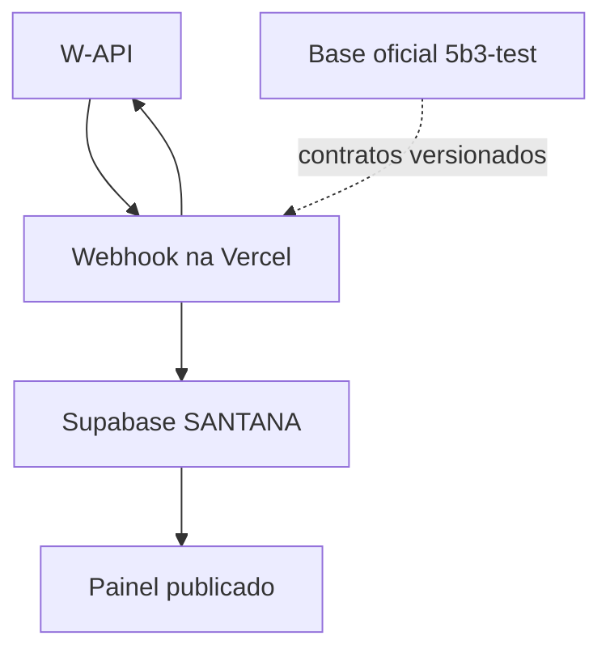

# Topologia de produção e convergência

## Estado atual

| Camada | Local atual | Papel |
|---|---|---|
| Autoridade de negócio | `cemiterio-santana-5b3-test` | regras, contratos, estados, testes e evolução |
| Aplicação publicada | `atendimento-cemiterio-santana` | painel e rotas HTTP |
| Banco e identidade | Supabase `SANTANA` | Postgres, Auth, RLS, Storage, Realtime e Edge Functions |
| Hospedagem | Vercel | build e execução da aplicação |
| Canal | W-API | conexão e transporte do WhatsApp |
| Orquestrador antigo | n8n | somente histórico; fora do runtime |

## Fluxo atual

O nome `support-n8n-gateway` é legado, mas a implementação é uma Edge Function
do Supabase ainda usada pela rota direta. O nome não significa que exista um
servidor n8n no fluxo.

## Regra de evolução

1. Toda nova regra nasce nesta base oficial.
2. O contrato é validado pelos testes desta base.
3. Um adaptador pequeno integra a regra ao runtime publicado.
4. Preview, CI e testes isolados passam antes do merge.
5. Mudanças de banco recebem migration, advisors e verificação pós-aplicação.
6. O painel existente permanece único durante a transição.

## O que não fazer

- não duplicar o painel inteiro;
- não reativar exports antigos do n8n;
- não usar `service_*` como fallback de produção;
- não copiar credenciais entre repositórios;
- não promover todas as migrations shadow em bloco;
- não declarar teste ponta a ponta concluído sem uma mensagem real da W-API.

## Convergência futura

A convergência deve ocorrer por domínio:

1. contrato de entrada e idempotência;
2. sessão e estado conversacional;
3. regras documentais e solicitações;
4. entrega e observabilidade;
5. retirada dos adaptadores legados;
6. rotação final de nomes e segredos antigos.

Cada etapa deve ser reversível. O repositório do painel só pode deixar de ser
runtime quando a nova aplicação contiver todas as rotas, UI, autenticação,
Realtime e integrações necessárias e já tiver passado pelo corte de produção.
