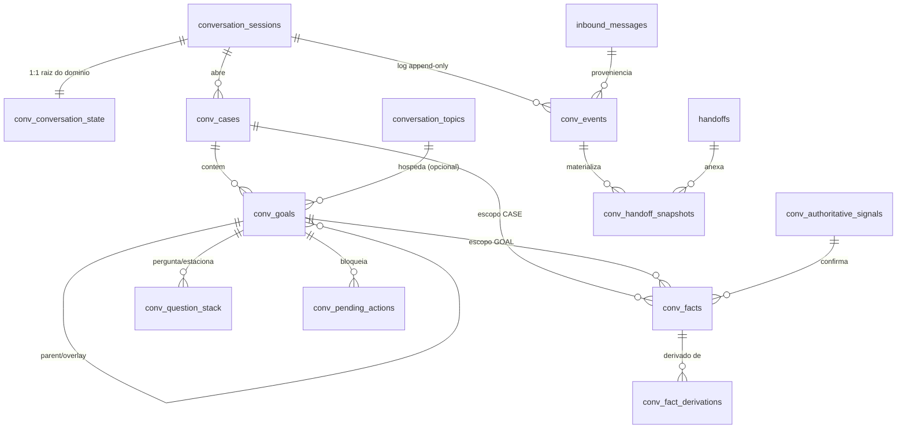

# Fase 5B.4-B — Persistence Design Review (sem migration)

Documento de revisão. **Nenhuma migration foi criada**, nada foi aplicado a banco algum, e nenhuma integração externa
(produção, n8n, WhatsApp/W-API, LLM, PostgREST, Vercel) foi tocada.

Baseline: `main` com migrations 0001–0019 (byte-idênticas) + domínio conversacional v1 da 5B.4-A/5B.4-A.1.

---

## 1. Auditoria do schema atual (`support_vnext_shadow`)

40 tabelas instaladas por 0001–0019. As relevantes para persistir conversa:

| Tabela                    | Papel hoje                                                    | Chaves/controles                                                                                                                              |
| ------------------------- | ------------------------------------------------------------- | --------------------------------------------------------------------------------------------------------------------------------------------- |
| `conversation_sessions`   | Sessão de atendimento; liga `conversation_id` ao `release_id` | PK `session_id`; unique parcial "uma sessão aberta por conversa"; `state_version bigint`; `inactivity_generation`; `status`/`automation_mode` |
| `conversation_topics`     | Assunto corrente da sessão (unidade do renderer 5B.2)         | PK `topic_id`; FK `session_id`, `intent_id`; `collected_data jsonb`; `topic_version`; unique parcial "um ACTIVE por sessão"                   |
| `pending_questions`       | Pergunta em aberto do renderer, por tópico                    | FK `topic_id`; `status OPEN/ANSWERED/EXPIRED/CANCELLED`; unique parcial "um OPEN por tópico"                                                  |
| `inbound_messages`        | Mensagem recebida (sombra)                                    | FK `session_id`,`topic_id`,`release_id`; `message_digest char(64)`; `source='SHADOW_INBOUND'`                                                 |
| `inbound_classifications` | Classificação da mensagem                                     | FK para `inbound_messages`                                                                                                                    |
| `service_requests`        | Solicitação protocolada                                       | `idempotency_key char(64) unique`; `protocol unique`; guard anti-gravidade em `RECLAMACAO`                                                    |
| `handoffs`                | Transferência para humano                                     | unique parcial "um ACTIVE por sessão"                                                                                                         |
| `state_events`            | Trilha de auditoria append-only                               | trigger `trg_state_events_append_only`; `correlation_id`; `metadata_redacted`                                                                 |
| `support_ruleset_release` | Versão do conjunto de regras                                  | imutabilidade após publicação; GUC controlado (0017)                                                                                          |

Convenções que o desenho abaixo **herda sem exceção**:

1. **RPC-only**: `service_role` não tem privilégio de tabela (0006 revoga; 0019 revoga PUBLIC em funções). Todo acesso
   passa por função `security definer` com `set search_path=pg_catalog,support_vnext_shadow,extensions`.
2. **RLS habilitada em todas as tabelas** do schema.
3. **Concorrência otimista** por `state_version`/`expected_state_version` + `select ... for update` +
   `pg_advisory_xact_lock`.
4. **Idempotência** por `char(64)` sha256 com `unique`.
5. **Imutabilidade por trigger** (`trg_*_immutable`, `trg_*_touch`) em vez de confiar no chamador.
6. **Forward-only**: nada de `DROP`/`ALTER` destrutivo em migration; correção vem em migration nova.

### Lacuna identificada

O schema atual persiste **sessão, tópico, pergunta única e solicitação**. Não existe nada que represente: `case`, pilha
de objetivos (`goal stack` com 5 estados), fatos com origem/confiança/supersessão, perguntas estacionadas, ações
pendentes autoritativas, nem log de eventos conversacionais. `conversation_topics.collected_data jsonb` é o único
depósito de dados coletados — sem histórico, sem origem, sem isolamento por falecido/jazigo. Persistir o domínio v1
dentro desse `jsonb` violaria diretamente as decisões 1–6 da 5B.4-A.1 (não haveria como provar origem autoritativa nem
supersessão).

---

## 2. Arquitetura proposta

Princípio: **não duplicar o que já existe**.

- A _conversation_ do domínio **é** a `conversation_sessions` existente (já carrega `conversation_id`, `release_id`,
  `status`, `state_version`, inatividade e RLS). Nenhuma tabela nova de sessão.
- `conversation_topics` continua sendo a unidade do renderer 5B.2; um `goal` pode apontar para um tópico (`topic_id`
  nullable), mas **um goal nunca atravessa dois tópicos** e um tópico pode hospedar vários goals.
- Tudo que é novo entra com prefixo `conv_`, em 9 tabelas normalizadas + 5 RPCs.

### 2.1 Tabelas

**`conv_conversation_state`** — raiz e ponto único de serialização.
`session_id uuid pk references conversation_sessions`, `seq bigint not null default 0`, `domain_version text not null`
(`santana-conversation-domain/v1`), `catalog_hash char(64) not null`, `state_hash char(64) not null`,
`created_at/updated_at`. É a linha travada (`for update`) por qualquer escrita da conversa: dá ordem total ao `seq`
lógico que o motor v1 já usa, e serve de âncora de concorrência otimista (`expected_seq`).

**`conv_cases`** — `case_id uuid pk`, `session_id` FK, `subject_kind` check
(`DECEASED|GRAVE|CONCESSION|ORDER|HOLDER|GENERIC`), `subject_ref_hash char(64)` (sha256 do identificador do sujeito;
**não** guardamos texto livre de PII aqui), `opened_at_seq bigint`, `status` (`OPEN|CLOSED`), `created_at`.
`unique (session_id, subject_kind, subject_ref_hash)` — a mesma pessoa/jazigo/pedido não abre dois cases.

**`conv_goals`** — `goal_id uuid pk`, `session_id` FK, `case_id` FK nullable (goals informativos herdam o case do pai ou
ficam nulos), `topic_id` FK nullable, `goal_code text`, `status` check nos 5 estados, `status_reason text`,
`parent_goal_id` FK self, `overlay_of` FK self, `stack_index int`, `informational bool`, `return_to_parent bool`,
`created_by_relation text`, `opened_at_seq`, `closed_at_seq`, `goal_version bigint default 1`.

**`conv_facts`** — append-only para valores. `fact_id uuid pk`, `session_id` FK, `case_id` FK nullable, `goal_id` FK
nullable, `fact_code text`, `value_kind` check (`TEXT|BOOL|NUM`), `value_text/value_bool/value_num` (exatamente um
preenchido, por check), `source` check nas 5 origens, `confidence` check nos 3 estados, `status` (`ACTIVE|SUPERSEDED`),
`authoritative bool not null default false`, `signal_id` FK nullable → `conv_authoritative_signals`, `recorded_at_seq`,
`superseded_by` FK self, `superseded_at_seq`, `supersession_reason` check nas 5 razões, `conflicts_with` FK self,
`inbound_message_id` FK nullable → `inbound_messages` (proveniência).

**`conv_fact_derivations`** — `(fact_id, from_fact_id)` PK composta, ambos FK para `conv_facts`. Substitui o array
`derived_from` do JSON por integridade referencial real (o array continua no read-model devolvido pela RPC).

**`conv_question_stack`** — pergunta corrente **e** estacionadas, sem destruir nenhuma. `question_id uuid pk`,
`session_id` FK, `goal_id` FK, `question_code text`, `fact_code text`, `priority_class` check nas 6 classes, `state`
check (`PENDING|PARKED|ANSWERED|CANCELLED`), `asked_at_seq`, `parked_at_seq`, `resolved_at_seq`, `park_order int`.

**`conv_pending_actions`** — lacunas autoritativas (decisões 1–4 e 6). `action_id uuid pk`, `session_id` FK, `goal_id`
FK, `action_code text`, `executor` check (`SYSTEM|HUMAN|SYSTEM_OR_HUMAN`), `fact_code text` (o fato que a ação
destrava), `status` (`PENDING|RESOLVED|CANCELLED`), `requested_at_seq`, `resolved_at_seq`, `resolved_by_signal_id` FK.

**`conv_authoritative_signals`** — a única porta de confirmação de fato autoritativo. `signal_id uuid pk`, `session_id`
FK, `source` check (`SYSTEM|DOCUMENT`), `actor text not null`, `idempotency_key char(64) unique`,
`payload_hash char(64)`, `received_at`, `applied_at_seq`.

**`conv_events`** — log conversacional append-only. PK composta `(session_id, event_seq)`, `event_id uuid unique`,
`event_kind` check nos 10 tipos, `idempotency_key char(64)`, `unique (session_id, idempotency_key)`,
`payload_hash char(64)`, `result jsonb not null default '{}'` (resposta devolvida — permite replay idempotente devolver
o mesmo resultado), `inbound_message_id` FK nullable, `correlation_id uuid`, `release_id` FK, `catalog_hash char(64)`,
`applied_at`.

**`conv_handoff_snapshots`** — modelo de handoff congelado no instante do pedido. `snapshot_id uuid pk`, `session_id`
FK, `handoff_id` FK nullable → `handoffs`, `goal_id` FK nullable, `at_seq bigint`, `snapshot jsonb not null` (validado
contra `state.schema.json#/$defs/handoff` por check de forma), `snapshot_hash char(64)`.

### 2.2 Índices

- `conv_facts (case_id, fact_code) where status='ACTIVE'` — leitura do fato vigente do case (caminho quente).
- `unique conv_facts (case_id, fact_code) where status='ACTIVE' and confidence <> 'CONFLICTING'` — no máximo **um** fato
  ativo não-conflitante por (case, código); o conflito é o único caso com dois ativos (C15).
- `conv_facts (session_id, recorded_at_seq)` — replay e auditoria.
- `unique conv_goals (case_id, goal_code) where status in ('ACTIVE','SUSPENDED','WAITING')` — não abre dois subfluxos
  iguais no mesmo case; reabertura pós-`DEPENDENCY_SATISFIED` é permitida porque o antigo está fechado.
- `unique conv_goals (session_id, stack_index)`.
- `unique conv_question_stack (session_id) where state='PENDING'` — uma pergunta corrente por conversa.
- `unique conv_pending_actions (goal_id, action_code) where status='PENDING'`.
- `conv_events (session_id, event_seq desc)`, `conv_events (correlation_id)`.
- `conv_cases (session_id)`, `conv_pending_actions (session_id) where status='PENDING'`.

### 2.3 Funções (RPC-only, `security definer`, `search_path` fixo)

| Função                                                                                                                  | Uso                                                                                             |
| ----------------------------------------------------------------------------------------------------------------------- | ----------------------------------------------------------------------------------------------- |
| `conv_apply_event(p_session_id uuid, p_expected_seq bigint, p_event jsonb, p_idempotency_key char(64))`                 | Aplica um evento conversacional; retorna `{seq, pending_question, pending_actions, goal_stack}` |
| `conv_apply_authoritative_signal(p_session_id uuid, p_expected_seq bigint, p_signal jsonb, p_idempotency_key char(64))` | Única via de confirmação autoritativa; recusa origem de usuário com `42501`                     |
| `conv_get_state(p_session_id uuid)`                                                                                     | Read-model completo, no formato de `state.schema.json` (retomada)                               |
| `conv_build_handoff(p_session_id uuid, p_handoff_id uuid)`                                                              | Congela o snapshot de handoff e o vincula a `handoffs`                                          |
| `conv_rollback_to_seq(p_session_id uuid, p_to_seq bigint, p_actor text, p_reason text)`                                 | Compensação lógica auditada (ver §7)                                                            |

Grants: `grant execute ... to service_role` apenas; nenhuma tabela `conv_*` recebe privilégio direto. Todas as tabelas
com `enable row level security` e sem policy permissiva (acesso só via definer).

### 2.4 Onde o motor v1 roda

O motor determinista continua sendo a **fonte da regra**; o banco é a fonte do **estado**. Duas opções:

- **Opção A (recomendada)**: as RPCs implementam o reducer em plpgsql, espelhando o motor v1, e o motor TypeScript
  permanece como oráculo de teste (a suíte P0 compara os dois em cima dos mesmos eventos).
- **Opção B**: as RPCs apenas persistem/leem e o reducer vive na edge function. Rejeitada nesta fase: deixaria
  invariantes de domínio (autoritativo, isolamento de case, supersessão) fora do banco, contrariando a linha 0001–0019
  de guardas no servidor.

---

## 3. Relação com session / topic / release / inbound_messages

- **session**: 1:1 com a conversa do domínio. `conv_conversation_state.session_id` é PK e FK. Sessão `CLOSED` rejeita
  novos eventos (`22023`), como já faz `persist_shadow_inbound_message`.
- **topic**: `conv_goals.topic_id` é opcional e só existe para casar o goal com o tópico que o renderer usa. A unicidade
  "um tópico ACTIVE por sessão" continua valendo para o renderer; a pilha de goals é do domínio e **não** herda essa
  restrição (é ela que permite subfluxo + overlay simultâneos).
- **release**: cada evento grava `release_id` (o da sessão no instante) e `catalog_hash`. Troca de release
  (`session_release_transitions`) **não invalida fatos já coletados**; invalida apenas a interpretação futura, e a
  divergência de `catalog_hash` é registrada para auditoria.
- **inbound_messages**: `conv_events.inbound_message_id` amarra o evento à mensagem que o originou, e os fatos criados
  por ele guardam a mesma referência. Sinal autoritativo **não** tem `inbound_message_id` — é justamente a marca que
  separa "o munícipe disse" de "a Administração confirmou".

---

## 4. Propriedades operacionais

**Idempotência.** `idempotency_key = sha256(session_id || event_kind || payload canônico || expected_seq)`.
`unique (session_id, idempotency_key)`; no replay a função detecta a chave, **não reaplica** e devolve
`conv_events.result` gravado. Mesma disciplina de `service_requests.idempotency_key`.

**Concorrência.** Ordem: `pg_advisory_xact_lock(hashtextextended('conv:'||session_id,0))` →
`select ... from conv_conversation_state where session_id=... for update` → confere `expected_seq = seq` → aplica →
`seq = seq + 1` + recalcula `state_hash`. Divergência levanta `55000 'conversation state moved'`, que o chamador resolve
relendo `conv_get_state`. Duas mensagens simultâneas da mesma conversa serializam; conversas diferentes não se
bloqueiam.

**Versionamento.** `domain_version` + `catalog_hash` por evento. Uma mudança de catálogo (v2) não reescreve histórico:
os eventos antigos continuam apontando para o hash com que foram decididos, e o replay sabe que regra usar.
`goal_version`/`state_version` cobrem atualização otimista de linha.

**Retomada.** `conv_get_state` reconstrói o estado normalizado no formato exato de `state.schema.json` (mesmo objeto que
o motor v1 consome), então uma conversa interrompida volta com pilha, fatos, pergunta corrente, estacionadas e ações
pendentes intactos. Não há snapshot autoritativo em JSON — `state_hash` é conferência, não fonte.

**Isolamento entre cases.** `case_id` é **imutável** (trigger recusa `UPDATE` da coluna); fato com escopo `CASE` exige
`case_id not null` e trigger valida `fact.case_id = goal.case_id`; não existe caminho que copie fato entre cases
(nenhuma RPC aceita `case_id` de origem e destino). C12 e D5 viram testes de banco.

**Supersessão/correção.** Valor nunca é alterado: `UPDATE` em `conv_facts` só pode tocar
`status, confidence, superseded_by, superseded_at_seq, supersession_reason, conflicts_with` — trigger
`trg_conv_facts_immutable` recusa alteração de `fact_code, value_*, source, case_id, goal_id, recorded_at_seq`. Correção
cria linha nova e supera a antiga; a cascata (`DEPENDENCY_INVALIDATED`) percorre `conv_fact_derivations` e os
`depends_on` do catálogo.

**Suspensão/retomada de goals.** Transições permitidas, validadas por trigger:
`ACTIVE→{SUSPENDED,WAITING,RESOLVED,ABANDONED}`, `SUSPENDED→{ACTIVE,ABANDONED}`, `WAITING→{ACTIVE,ABANDONED}`;
`RESOLVED` e `ABANDONED` são terminais. **Não existe reabertura de goal**: recalcular uma dependência abre uma linha
nova (foi exatamente a decisão 5), o que mantém o histórico legível.

---

## 5. Invariantes

| #   | Invariante                                         | Como é garantida                                                                                            |
| --- | -------------------------------------------------- | ----------------------------------------------------------------------------------------------------------- |
| I1  | Uma pergunta corrente por conversa                 | unique parcial em `conv_question_stack`                                                                     |
| I2  | Pergunta paralela nunca destrói a corrente         | `PENDING→PARKED` (nunca `DELETE`), `park_order`                                                             |
| I3  | Um fato ativo por (case, código), salvo conflito   | unique parcial em `conv_facts`                                                                              |
| I4  | Fato autoritativo só é `CONFIRMED` com `signal_id` | check `(authoritative and confidence='CONFIRMED') = (signal_id is not null)` + validação do catálogo na RPC |
| I5  | Origem de usuário nunca produz `authoritative`     | check `source in ('SYSTEM','DOCUMENT')` quando `authoritative`                                              |
| I6  | Valor de fato é imutável                           | trigger de imutabilidade                                                                                    |
| I7  | `case_id` é imutável e nunca cruzado               | trigger + FK + ausência de caminho de cópia                                                                 |
| I8  | Goal terminal não volta                            | trigger de transição                                                                                        |
| I9  | Um subfluxo aberto por (case, goal_code)           | unique parcial em `conv_goals`                                                                              |
| I10 | `stack_index` único e crescente por sessão         | unique + `seq` monotônico                                                                                   |
| I11 | Overlay não substitui a base                       | `overlay_of not null` ⇒ base permanece `ACTIVE` (check na RPC + teste)                                      |
| I12 | Nenhuma classificação automática de gravidade      | check anti-chave (mesmo padrão de `service_requests`) sobre `conv_facts.fact_code` e payloads               |
| I13 | `conv_events` é append-only                        | trigger `append_only` (padrão de `state_events`)                                                            |
| I14 | `seq` é ordem total por conversa                   | linha raiz travada + `event_seq = seq`                                                                      |
| I15 | Replay é idempotente e devolve o mesmo resultado   | `unique (session_id, idempotency_key)` + `result` gravado                                                   |
| I16 | Sessão `CLOSED` não aceita evento                  | guarda na RPC (`22023`)                                                                                     |

---

## 6. Testes propostos

**PostgreSQL determinista (novos `tests/postgres/p16_*`–`p22_*`, no laboratório isolado):**

- `S01` idempotência: mesmo `idempotency_key` duas vezes → um único evento, mesmo `result`, `seq` inalterado.
- `S02` concorrência real (duas sessões psql, barreira, como P09/P11): dois `conv_apply_event` concorrentes na mesma
  conversa → um aplica, o outro recebe `55000`; nenhum estado intermediário visível.
- `S03` conversas diferentes em paralelo não se bloqueiam.
- `S04` isolamento: tentativa de gravar fato de case A no goal do case B → erro; nenhuma cópia possível.
- `S05` imutabilidade: `UPDATE` de `value_*`/`fact_code`/`case_id` → recusado.
- `S06` supersessão: correção supera o antigo, cascateia por `conv_fact_derivations` e mantém histórico.
- `S07` conflito: dois ativos com `CONFLICTING`, unique parcial não dispara; resolução deixa exatamente um.
- `S08` autoritativo: declaração de usuário grava `UNCERTAIN` sem `signal_id`; sinal `SYSTEM/DOCUMENT` confirma.
- `S09` recusa de sinal autoritativo com origem de usuário (`42501`).
- `S10` goal stack: push/suspend/resolve/resume/abandon; transições ilegais recusadas.
- `S11` reabertura pós-`DEPENDENCY_SATISFIED` cria goal novo (decisão 5), e goal terminal não volta.
- `S12` pergunta paralela: corrente vai a `PARKED` e volta com o mesmo `question_id`.
- `S13` ações pendentes: uma `PENDING` por (goal, ação); resolução pelo sinal fecha exatamente uma.
- `S14` retomada: `conv_get_state` reproduz o estado byte-a-byte esperado após 20 eventos.
- `S15` privilégios: `service_role` sem `SELECT/INSERT` direto nas `conv_*`; só EXECUTE nas 5 RPCs; PUBLIC sem EXECUTE.
- `S16` append-only de `conv_events`: `UPDATE`/`DELETE` recusados.
- `S17` rollback lógico: `conv_rollback_to_seq` restaura o estado do `seq` alvo e deixa trilha; nada é apagado.
- `S18` release: troca de release não invalida fatos; `catalog_hash` divergente fica registrado.

**Paridade motor × banco (nova suíte `tests/parity/`):** os 22 cenários C01–C16 + D1–D6 são reproduzidos contra as RPCs
e comparados com o estado produzido pelo motor v1 — **gate: 22/22 idênticos**. É esse teste que impede o reducer plpgsql
de divergir silenciosamente do catálogo.

**Estático (CI, sem banco):** validação de que cada `fact_code`/`goal_code`/`action_code` da migration existe no
catálogo v1, e vice-versa.

---

## 7. Rollback

1. **Transacional**: cada RPC é uma transação; erro não deixa estado parcial.
2. **Lógico (dado)**: `conv_rollback_to_seq` — compensação _forward-only_: marca como `SUPERSEDED`/`CANCELLED` o que
   veio depois do `seq` alvo, grava um evento `SYSTEM_ROLLBACK` em `conv_events` e um registro em `state_events`. **Nada
   é deletado**; o histórico da conversa continua auditável.
3. **Estrutural (schema)**: 0020 é forward-only. Reverter = migration 0021 que remove os objetos criados (todos novos,
   sem dependentes fora do próprio conjunto `conv_*`), e no laboratório o procedimento físico de reset→instalação já
   provado na 5B.3.

---

## 8. Riscos

| Risco                                                   | Nível    | Mitigação                                                                                                           |
| ------------------------------------------------------- | -------- | ------------------------------------------------------------------------------------------------------------------- |
| Reducer duplicado (plpgsql + TypeScript) divergir       | **ALTO** | suíte de paridade 22/22 obrigatória no gate; catálogo é a única fonte de códigos                                    |
| Volume de `conv_facts`/`conv_events` crescer sem poda   | MÉDIO    | índices por `(session_id, seq)`; política de retenção a definir antes de qualquer uso real                          |
| `conv_question_stack` e `pending_questions` conviverem  | MÉDIO    | fronteira documentada: renderer usa a antiga, domínio usa a nova; unificação é fase própria, não 5B.4-B             |
| PII em `subject_ref`/`snapshot`                         | MÉDIO    | `subject_ref_hash` em vez de texto; snapshot de handoff só com códigos e valores de domínio; nada de conteúdo livre |
| Serialização por conversa virar gargalo                 | BAIXO    | lock é por sessão; medir antes de otimizar                                                                          |
| Troca de release no meio da conversa                    | BAIXO    | `catalog_hash` por evento + I18/S18                                                                                 |
| `service_role` ganhar privilégio de tabela por descuido | BAIXO    | 0019 + teste S15 no gate                                                                                            |

---

## 9. Justificativa para a migration 0020

A 0020 é necessária e **não** tem alternativa aceitável dentro de 0001–0019:

- `conversation_topics.collected_data jsonb` não tem origem, confiança, supersessão nem escopo por case — usá-lo
  tornaria as decisões 1–6 da 5B.4-A.1 inverificáveis no banco.
- `pending_questions` é por tópico e admite uma única aberta: não representa pergunta estacionada nem pilha.
- Não existe hoje nenhuma tabela para `case`, goal stack ou ação autoritativa pendente.

Forma proposta: **uma única migration 0020, aditiva**, criando as 9 tabelas `conv_*`, seus índices, triggers, as 5
funções e os grants — sem `ALTER` em tabela existente, exceto a adição de FKs _nullable_ de conveniência
(`conv_goals.topic_id`, `conv_events.inbound_message_id`), que não alteram nenhuma tabela de 0001–0019. Se a revisão
preferir granularidade, alternativa 0020 (tabelas) + 0021 (funções/grants) — a recomendação é arquivo único, porque as
guardas só fazem sentido junto com as tabelas que protegem.

---

## 10. GO / NO-GO

**GO condicional para implementar a 0020**, com as seguintes condições de aceite obrigatórias:

1. Reducer no banco (Opção A) com suíte de paridade **22/22** contra o motor v1.
2. `S01`–`S18` verdes no laboratório isolado, com S02 usando concorrência PostgreSQL real (duas sessões/barreira).
3. `S15` provando o modelo RPC-only (nenhum privilégio de tabela para `service_role`, nenhum EXECUTE para PUBLIC).
4. Nenhuma alteração em 0001–0019; 0020 aditiva e forward-only.
5. Política de retenção de `conv_events`/`conv_facts` decidida por humano antes de qualquer uso não-laboratorial.

**Questões que exigem decisão humana antes da 0020:**

- (a) Unificar `conv_question_stack` com `pending_questions` agora ou manter as duas camadas? (recomendação: manter)
- (b) Retenção/expurgo de histórico conversacional — prazo e responsável.
- (c) `subject_ref` como hash (recomendado) ou como referência a um cadastro oficial de falecido/jazigo.
- (d) Reducer em plpgsql (Opção A, recomendada) ou na edge function (Opção B).
