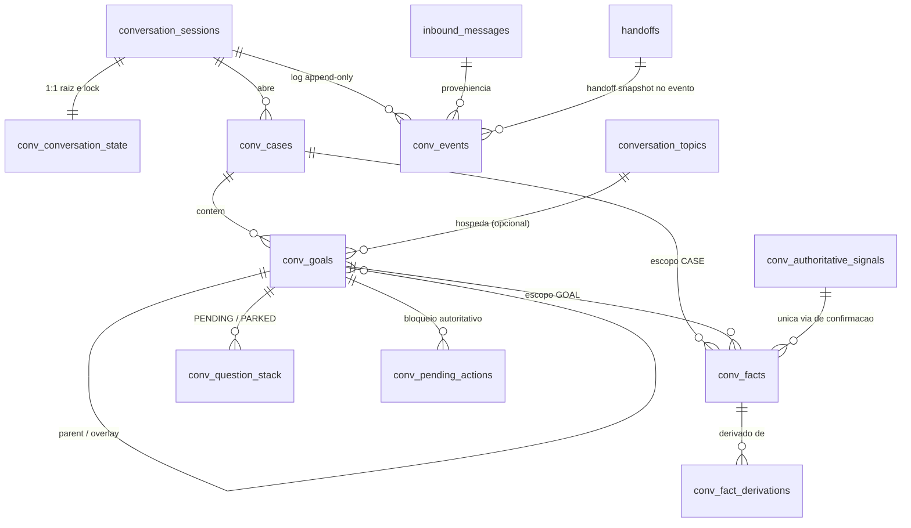

# Fase 5B.4-B / 5B.4-B.1 — Persistence Design Review (revisado, sem migration)

Documento de revisão. **Nenhuma migration foi criada**, nada foi aplicado a banco algum, e nenhuma integração externa
(produção, Supabase, n8n, WhatsApp/W-API, LLM, PostgREST, Vercel) foi tocada.

Baseline: `main` com migrations 0001–0019 (byte-idênticas) + domínio conversacional v1 da 5B.4-A/5B.4-A.1.

**Revisão 5B.4-B.1** — este documento substitui a versão anterior e incorpora seis decisões humanas:

| # | Decisão                                                                                                                                                                 | Efeito no desenho                                          |
| - | ----------------------------------------------------------------------------------------------------------------------------------------------------------------------- | ---------------------------------------------------------- |
| 1 | `conv_question_stack` é a fonte de verdade conversacional; `pending_questions` fica por compatibilidade, sem dual source of truth nem sincronização bidirecional        | §2.2, §3.2 — projeção unidirecional opcional, fora da 0020 |
| 2 | Sem prazo institucional de retenção agora; 0020 pode preparar metadados, sem job/trigger/expurgo                                                                        | §2.1, §4.6                                                 |
| 3 | Sem PII direta; referência pseudonimizada por **HMAC-SHA-256** com chave própria versionada, nunca SHA-256 de documento, nunca reutilizar `CLASSIFIER_AUTHORITY_SECRET` | §2.1 (`conv_cases`), §4.7                                  |
| 4 | **Não** duplicar o reducer em PL/pgSQL: o reducer canônico é o TypeScript; o banco é autoridade de integridade e persistência                                           | §2.3, §3, §5 — RPCs redesenhadas                           |
| 5 | Corrigir a contagem de tabelas e justificar cada uma; simplificar o que der                                                                                             | §2.1 — 10 → **9 tabelas**                                  |
| 6 | Rollback lógico append-only: compensar com evento novo, nunca apagar/reescrever                                                                                         | §6                                                         |

---

## 1. Auditoria do schema atual (`support_vnext_shadow`)

40 tabelas instaladas por 0001–0019. As relevantes para persistir conversa:

| Tabela                    | Papel hoje                                                    | Chaves/controles                                                                                           |
| ------------------------- | ------------------------------------------------------------- | ---------------------------------------------------------------------------------------------------------- |
| `conversation_sessions`   | Sessão de atendimento; liga `conversation_id` ao `release_id` | PK `session_id`; unique parcial "uma sessão aberta por conversa"; `state_version`; `inactivity_generation` |
| `conversation_topics`     | Assunto corrente (unidade do renderer 5B.2)                   | PK `topic_id`; `collected_data jsonb`; `topic_version`; unique parcial "um ACTIVE por sessão"              |
| `pending_questions`       | Pergunta em aberto do renderer, por tópico                    | `status OPEN/ANSWERED/EXPIRED/CANCELLED`; unique parcial "um OPEN por tópico"                              |
| `inbound_messages`        | Mensagem recebida (sombra)                                    | FK `session_id`,`topic_id`,`release_id`; `message_digest char(64)`                                         |
| `inbound_classifications` | Classificação da mensagem                                     | FK para `inbound_messages`                                                                                 |
| `service_requests`        | Solicitação protocolada                                       | `idempotency_key char(64) unique`; `protocol unique`; guard anti-gravidade em `RECLAMACAO`                 |
| `handoffs`                | Transferência para humano                                     | unique parcial "um ACTIVE por sessão"                                                                      |
| `state_events`            | Trilha de auditoria append-only                               | trigger append-only; `correlation_id`; `metadata_redacted`                                                 |
| `classifier_authorities`  | Autoridade HMAC do classificador (5B.2-C4)                    | `authority_key_id`, `verifier_secret`, janela de validade — **não é reutilizada aqui**                     |
| `support_ruleset_release` | Versão do conjunto de regras                                  | imutabilidade após publicação; GUC controlado (0017)                                                       |

Convenções herdadas sem exceção: **RPC-only** (`service_role` sem privilégio de tabela; 0019 revoga PUBLIC), **RLS em
todas as tabelas**, **concorrência otimista** (`state_version` + `for update` + advisory lock), **idempotência**
`char(64)` com `unique`, **imutabilidade por trigger**, **forward-only**.

### Lacuna

Nada no schema representa `case`, pilha de objetivos com 5 estados, fatos com origem/confiança/supersessão, perguntas
estacionadas, ações autoritativas pendentes ou log conversacional. `collected_data jsonb` não tem origem, histórico nem
isolamento por falecido/jazigo — usá-lo tornaria as decisões 1–6 da 5B.4-A.1 inverificáveis no banco.

---

## 2. Modelo revisado

### 2.0 Princípios após a 5B.4-B.1

1. A _conversation_ do domínio **é** a `conversation_sessions` existente. Nenhuma tabela nova de sessão.
2. O **reducer semântico é o TypeScript** (`santana-conversation-domain/engine`). O banco **não reimplementa**
   next-best-question, relações, cascatas nem prioridades.
3. O banco é **autoridade de integridade**: ordem, idempotência, constraints, isolamento de case, imutabilidade,
   supersessão, autoridade de sinal, privilégios, append-only e validação **estrutural** das transições propostas. Uma
   transição inválida é recusada, não corrigida.
4. `conv_question_stack` é a fonte de verdade conversacional; `pending_questions` permanece intocada.



### 2.1 Lista final: **9 tabelas** (era 10; `conv_handoff_snapshots` eliminada)

| # | Tabela                       | Responsabilidade                                                                                           | Por que não pode ser eliminada                                                                                                     |
| - | ---------------------------- | ---------------------------------------------------------------------------------------------------------- | ---------------------------------------------------------------------------------------------------------------------------------- |
| 1 | `conv_conversation_state`    | Raiz 1:1 com a sessão: `seq` lógico, `domain_version`, `catalog_hash`, `state_hash`, metadados de retenção | É o ponto de `FOR UPDATE` que dá ordem total e sustenta `expected_seq`. Sem ela não há serialização nem idempotência confiável     |
| 2 | `conv_cases`                 | Sujeito do atendimento, pseudonimizado (§4.7)                                                              | O isolamento entre falecidos/jazigos/pedidos é uma invariante de negócio; precisa de entidade própria com FK                       |
| 3 | `conv_goals`                 | Pilha de objetivos, 5 estados, parent/overlay/stack_index                                                  | Não há estrutura equivalente; a semântica de subfluxo/overlay depende de linhas distintas                                          |
| 4 | `conv_facts`                 | Fato com valor, origem, confiança, autoridade, supersessão                                                 | Núcleo das decisões 1–6; `jsonb` não sustenta constraint nem histórico                                                             |
| 5 | `conv_fact_derivations`      | Aresta `fato derivado → fato de origem`                                                                    | Integridade referencial real da cascata de invalidação. Alternativa (`uuid[]`) perderia FK e tornaria S06 não verificável no banco |
| 6 | `conv_question_stack`        | Pergunta corrente e estacionadas (fonte de verdade — decisão 1)                                            | `pending_questions` admite uma OPEN por tópico e não representa estacionamento                                                     |
| 7 | `conv_pending_actions`       | Ação autoritativa pendente que bloqueia um goal                                                            | Semântica distinta de pergunta: destinatário é a Administração, não o munícipe                                                     |
| 8 | `conv_authoritative_signals` | Registro do sinal externo (SYSTEM/DOCUMENT) que confirma fato autoritativo                                 | Sem ela não há como provar _quem_ confirmou; é o que separa alegação de fato                                                       |
| 9 | `conv_events`                | Log conversacional append-only, idempotente, com `result` e snapshot de handoff                            | Auditoria, replay e idempotência                                                                                                   |

**Simplificação aplicada (decisão 5).** `conv_handoff_snapshots` foi removida: o snapshot de handoff é o `result` do
evento `HUMAN_REQUEST` em `conv_events`, com `handoff_id` nullable apontando para `handoffs`. Ganha-se append-only e
idempotência de graça, e nenhuma invariante ou trilha de auditoria se perde. Nenhuma outra tabela pôde ser eliminada sem
perder invariante ou prova de auditoria — a justificativa individual está na coluna acima.

**Colunas de retenção (decisão 2)** — apenas metadados, **sem job, sem trigger, sem expurgo**:
`conv_conversation_state.closed_at timestamptz null`, `retention_class text null`, `purge_after timestamptz null`. Nada
em 0020 lê ou aplica esses campos; existem para que a política institucional futura não exija outra migration
estrutural.

### 2.2 Índices

- `unique conv_facts (case_id, fact_code) where status='ACTIVE' and confidence <> 'CONFLICTING'`
- `conv_facts (case_id, fact_code) where status='ACTIVE'` · `conv_facts (session_id, recorded_at_seq)`
- `unique conv_goals (case_id, goal_code) where status in ('ACTIVE','SUSPENDED','WAITING')`
- `unique conv_goals (session_id, stack_index)`
- `unique conv_question_stack (session_id) where state='PENDING'`
- `unique conv_pending_actions (goal_id, action_code) where status='PENDING'`
- `unique conv_events (session_id, idempotency_key)` · `conv_events (session_id, event_seq desc)` ·
  `conv_events (correlation_id)`
- `unique conv_cases (session_id, subject_kind, subject_ref_hmac)` ·
  `unique conv_authoritative_signals (idempotency_key)`

### 2.3 RPCs revisadas (decisão 4)

Quatro funções `security definer`, `search_path` fixo, `grant execute` só para `service_role`:

| RPC                               | Assinatura                                                                                                             | Papel                                                                                                                                                                                                             |
| --------------------------------- | ---------------------------------------------------------------------------------------------------------------------- | ----------------------------------------------------------------------------------------------------------------------------------------------------------------------------------------------------------------- |
| `conv_get_state`                  | `(p_session_id uuid)` → `jsonb`                                                                                        | Read-model no formato de `state.schema.json`, com `seq` e `catalog_hash`. Alimenta o reducer TypeScript                                                                                                           |
| `conv_apply_transition`           | `(p_session_id uuid, p_expected_seq bigint, p_transition jsonb, p_idempotency_key char(64))` → `jsonb`                 | Valida **estruturalmente** e persiste a transição já calculada pelo reducer. **Recusa** qualquer operação com `authoritative=true` (`42501`)                                                                      |
| `conv_apply_authoritative_signal` | `(p_session_id uuid, p_expected_seq bigint, p_signal jsonb, p_transition jsonb, p_idempotency_key char(64))` → `jsonb` | Única via que grava `authoritative=true`/`signal_id`. Persiste o sinal e a transição decorrente na **mesma transação**; toda marca de autoridade na transição precisa estar coberta por este sinal, senão `42501` |
| `conv_rollback_to_seq`            | `(p_session_id uuid, p_to_seq bigint, p_actor text, p_reason text)` → `jsonb`                                          | Compensação append-only (§6)                                                                                                                                                                                      |

`conv_apply_transition` e `conv_apply_authoritative_signal` têm **grants separados**, permitindo que uma fase futura
conceda a segunda a um papel administrativo distinto sem tocar a primeira.

O que `conv_apply_transition` valida (validação estrutural, não semântica):

1. `expected_seq` bate com `conv_conversation_state.seq` (senão `55000`).
2. Sessão existe e não está `CLOSED` (senão `22023`).
3. Todo `fact_code`, `goal_code`, `question_code`, `action_code` existe no catálogo persistido (`catalog_hash` confere
   com o do read-model que originou a transição; divergência → `22023`).
4. Toda operação respeita as constraints/triggers das tabelas: transição de goal permitida, `case_id` coerente e
   imutável, valor de fato imutável, supersessão com razão válida, no máximo uma pergunta `PENDING`, uma ação `PENDING`
   por (goal, ação).
5. Nenhuma operação marca autoridade — essa é a fronteira que separa as duas RPCs.

O que ela **não** faz: escolher a próxima pergunta, avaliar relações, decidir prioridade, derivar fatos. Isso é do
reducer.

---

## 3. Fluxo TypeScript → PostgreSQL

### 3.1 Ciclo de um evento conversacional

```
1. Edge/worker  : state0 = conv_get_state(session_id)        -- {state, seq, catalog_hash}
2. TypeScript   : state1 = applyEvent(state0.state, event)   -- reducer canonico, deterministico
3. TypeScript   : transition = diff(state0.state, state1)    -- operacoes explicitas, sem "estado inteiro"
4. PostgreSQL   : conv_apply_transition(session_id, state0.seq, transition, idem_key)
                  -> valida + persiste atomicamente; devolve {seq, pending_question, pending_actions}
5. Divergencia  : erro 55000 -> repete do passo 1 (outra transacao avancou a conversa)
```

O `diff` é uma lista tipada de operações (`open_case`, `push_goal`, `set_goal_status`, `record_fact`, `supersede_fact`,
`link_derivation`, `set_question`, `park_question`, `resolve_question`, `open_action`, `resolve_action`, `log_event`).
Cada operação mapeia 1:1 para uma escrita validada — o banco nunca recebe "o estado inteiro" e nunca precisa recalcular
nada.

### 3.2 Sinal autoritativo

```
1. conv_get_state
2. TypeScript : state1 = applyAuthoritativeSignal(state0.state, signal)
3. TypeScript : transition = diff(...)  -- inclui fatos com authoritative=true
4. PostgreSQL : conv_apply_authoritative_signal(session_id, seq, signal, transition, idem_key)
                -> grava o sinal, confere que cada fato autoritativo da transicao esta coberto por ele,
                   recusa origem USER_* (42501) e so entao persiste
```

Uma transição comum **jamais** promove alegação `USER_EXPLICIT`/`USER_CORRECTION`/extração de LLM a fato autoritativo: a
operação é recusada pelo próprio `conv_apply_transition`, mesmo que o cliente peça.

### 3.3 Fronteira com o renderer legado (decisão 1)

`conv_question_stack` é a fonte de verdade. `pending_questions` continua sendo escrita pelo caminho C4/renderer como
hoje, sem qualquer sincronização com `conv_*`. Não há leitura cruzada, não há trigger entre as duas, não há
reconciliação. Se no futuro for desejável refletir a pergunta conversacional ativa no mecanismo legado, isso será uma
**projeção unidirecional** (`conv_question_stack` → `pending_questions`), em fase própria e fora do escopo da 0020.

---

## 4. Propriedades operacionais

**4.1 Idempotência.** `idempotency_key = sha256(session_id || kind || transição canônica || expected_seq)`,
`unique (session_id, idempotency_key)`. No replay a RPC detecta a chave, **não reaplica** e devolve `conv_events.result`
gravado — mesmo `seq`, mesma resposta.

**4.2 Concorrência.** `pg_advisory_xact_lock(hashtextextended('conv:'||session_id,0))` →
`select ... from conv_conversation_state where session_id = ... for update` → confere `expected_seq` → aplica →
`seq = seq + 1`. Divergência levanta `55000 'conversation state moved'`; o chamador relê e **recalcula no reducer**
(nunca "força" a escrita). Conversas distintas não se bloqueiam.

**4.3 Versionamento.** `domain_version` + `catalog_hash` gravados na raiz e em cada evento. Uma transição calculada
sobre um catálogo diferente do persistido é recusada — impede que uma v2 do domínio escreva por cima de estado decidido
pela v1. Histórico nunca é reescrito.

**4.4 Retomada.** `conv_get_state` reconstrói o estado normalizado no formato exato de `state.schema.json`, que é o
mesmo objeto que o reducer consome. Conversa interrompida volta com pilha, fatos, pergunta corrente, estacionadas e
ações pendentes intactos. `state_hash` é conferência, não fonte.

**4.5 Isolamento entre cases.** `case_id` imutável por trigger; fato de escopo `CASE` exige `case_id not null` e trigger
valida `fact.case_id = goal.case_id`; nenhuma RPC aceita origem e destino de case. Não existe caminho de cópia entre
cases.

**4.6 Retenção.** Metadados preparados, nada automático (decisão 2). Nenhum `DELETE` programado, nenhum job, nenhum
trigger de expurgo em 0020.

**4.7 Pseudonimização do sujeito (decisão 3).** `conv_cases.subject_ref_hmac char(64)` +
`identity_key_version smallint not null`. O valor é **HMAC-SHA-256** do identificador, calculado **fora do banco**
(edge/worker) com um segredo **dedicado à identidade** — `SANTANA_IDENTITY_HMAC_SECRET_V<n>` — distinto e independente
de `CLASSIFIER_AUTHORITY_SECRET`, que **não** é reutilizado. O segredo nunca entra no schema `support_vnext_shadow`: o
banco vê apenas o digest opaco e a versão da chave, o que basta para igualdade e isolamento. Rotação = nova versão;
linhas antigas mantêm a sua (`identity_key_version`), sem re-hash de histórico; cases de versões diferentes simplesmente
não colidem, e a reconciliação, se um dia for necessária, é decisão humana à parte. Nenhuma PII direta (nome, CPF,
documento, endereço) em tabela `conv_*` — inclusive no snapshot de handoff, que carrega códigos e valores de domínio,
não texto livre.

---

## 5. Invariantes que permanecem no banco

Com o reducer fora do banco, estas continuam sendo garantidas **por constraint/trigger/RPC**, não por confiança no
chamador:

| #   | Invariante                                       | Mecanismo                                                                           |
| --- | ------------------------------------------------ | ----------------------------------------------------------------------------------- |
| I1  | Uma pergunta `PENDING` por conversa              | unique parcial                                                                      |
| I2  | Pergunta paralela nunca é destruída              | `PENDING→PARKED`; `DELETE` bloqueado por trigger                                    |
| I3  | Um fato ativo por (case, código), salvo conflito | unique parcial                                                                      |
| I4  | `authoritative=true` ⇔ existe `signal_id`        | check + RPC dedicada                                                                |
| I5  | Origem de usuário nunca vira autoritativa        | check `source in ('SYSTEM','DOCUMENT')` + recusa `42501` em `conv_apply_transition` |
| I6  | Valor de fato é imutável                         | trigger de imutabilidade                                                            |
| I7  | `case_id` imutável e nunca cruzado               | trigger + FK                                                                        |
| I8  | Goal terminal não volta                          | trigger de transição                                                                |
| I9  | Um subfluxo aberto por (case, goal_code)         | unique parcial                                                                      |
| I10 | `stack_index` único por sessão                   | unique                                                                              |
| I11 | Overlay não substitui a base                     | check na RPC + teste                                                                |
| I12 | Nenhuma gravidade automática em reclamação       | check anti-chave (padrão de `service_requests`)                                     |
| I13 | `conv_events` append-only                        | trigger                                                                             |
| I14 | `seq` é ordem total por conversa                 | linha raiz travada                                                                  |
| I15 | Replay idempotente devolve o mesmo resultado     | unique + `result` gravado                                                           |
| I16 | Sessão `CLOSED` não aceita transição             | guarda na RPC (`22023`)                                                             |
| I17 | Códigos fora do catálogo são recusados           | validação contra `catalog_hash` + tabela de códigos                                 |
| I18 | Rollback não apaga nem reescreve histórico       | trigger append-only + compensação (§6)                                              |

---

## 6. Rollback (decisão 6)

1. **Transacional**: cada RPC é uma transação; erro não deixa estado parcial.
2. **Lógico, append-only**: `conv_rollback_to_seq` **não** apaga nem edita eventos. Ela grava um novo evento
   `SYSTEM_ROLLBACK` (com `to_seq`, ator e motivo), aplica compensações como escritas novas — fatos posteriores ao alvo
   passam a `SUPERSEDED` com razão `ROLLBACK`, goals abertos depois do alvo vão a `ABANDONED` com
   `status_reason='ROLLBACK'`, perguntas/ações posteriores a `CANCELLED` — e avança o `seq`. O histórico completo
   continua legível: vê-se o que houve **e** que houve rollback.
3. **Estrutural**: 0020 é forward-only; reverter = 0021 removendo objetos novos (sem dependentes fora de `conv_*`), e no
   laboratório o reset físico já provado na 5B.3.

---

## 7. Impacto nos testes

### 7.1 S01–S18 revisados

| Teste                                                    | Situação após 5B.4-B.1                                                                                          |
| -------------------------------------------------------- | --------------------------------------------------------------------------------------------------------------- |
| S01 idempotência de replay                               | mantido                                                                                                         |
| S02 concorrência real (2 sessões psql, barreira)         | mantido — agora testa `conv_apply_transition` com `expected_seq`                                                |
| S03 conversas paralelas não se bloqueiam                 | mantido                                                                                                         |
| S04 isolamento de case                                   | mantido                                                                                                         |
| S05 imutabilidade de valor                               | mantido                                                                                                         |
| S06 supersessão + cascata por `conv_fact_derivations`    | mantido (a cascata é **calculada** no TS e **verificada** no banco)                                             |
| S07 conflito (dois ativos)                               | mantido                                                                                                         |
| S08 alegação `UNCERTAIN` sem `signal_id`                 | mantido                                                                                                         |
| S09 recusa de sinal com origem de usuário                | mantido                                                                                                         |
| **S09b (novo)**                                          | `conv_apply_transition` recusa transição que marque `authoritative=true` (`42501`)                              |
| S10 transições de goal                                   | **reescopo**: valida a recusa de transição ilegal, não a escolha da transição                                   |
| S11 reabertura pós-`DEPENDENCY_SATISFIED`                | mantido                                                                                                         |
| S12 pergunta estacionada volta com o mesmo `question_id` | mantido                                                                                                         |
| S13 uma ação `PENDING` por (goal, ação)                  | mantido                                                                                                         |
| S14 retomada byte-a-byte via `conv_get_state`            | mantido                                                                                                         |
| S15 privilégios RPC-only                                 | **ampliado**: grants separados das duas RPCs de escrita                                                         |
| S16 append-only de `conv_events`                         | mantido                                                                                                         |
| S17 rollback                                             | **reescopo**: prova que nada foi apagado/reescrito e que a compensação é evento novo                            |
| S18 troca de release não invalida fatos                  | mantido                                                                                                         |
| **S19 (novo)**                                           | transição com `catalog_hash` divergente é recusada                                                              |
| **S20 (novo)**                                           | transição com código fora do catálogo é recusada                                                                |
| **S21 (novo)**                                           | `pending_questions` **não** é lida nem escrita por nenhuma RPC `conv_*` (ausência de dual source of truth)      |
| **S22 (novo)**                                           | `conv_cases` só aceita `subject_ref_hmac` de 64 hex + `identity_key_version > 0`; nenhuma coluna de texto livre |
| ~~parity plpgsql~~                                       | **removido**: não há reducer em plpgsql para comparar                                                           |

### 7.2 Paridade C01–C16 / D1–D6

Continua sendo o gate, com sentido novo: **round-trip**, não paridade de dois reducers. Para cada um dos 22 cenários:
rodar o reducer TypeScript, aplicar cada transição pela RPC e exigir que `conv_get_state` devolva **exatamente** o
estado do reducer (mesma comparação por igualdade estrutural que a suíte P0 já faz). **Gate: 22/22.** Isso prova
persistência fiel sem duplicar lógica — e como o reducer é único, não existe a classe de defeito "duas implementações
divergindo".

Os 26 testes atuais (C01–C16, D1–D6, handoff, social, 2 estáticos) continuam rodando **sem banco** no `shadow-static`,
inalterados.

---

## 8. Riscos residuais

| Risco                                                                                       | Nível     | Mitigação                                                                                                                                                                                                            |
| ------------------------------------------------------------------------------------------- | --------- | -------------------------------------------------------------------------------------------------------------------------------------------------------------------------------------------------------------------- |
| Cliente malicioso/defeituoso enviar transição inconsistente                                 | **MÉDIO** | o banco recusa por constraint/trigger/RPC (I1–I18); nenhuma invariante depende do chamador. Sobra o risco de uma transição _válida porém semanticamente errada_ — mitigado por round-trip 22/22 e pelo reducer único |
| `diff(state0, state1)` produzir operação incompleta                                         | MÉDIO     | `state_hash` esperado viaja na transição; divergência entre o hash calculado após aplicar e o esperado aborta a transação                                                                                            |
| Duas camadas de pergunta (`conv_question_stack` × `pending_questions`) confundirem operação | MÉDIO     | fronteira explícita, sem sincronização, e S21 provando ausência de acoplamento                                                                                                                                       |
| Segredo de identidade mal gerido (rotação, vazamento)                                       | MÉDIO     | segredo dedicado, fora do banco, versionado; nunca `CLASSIFIER_AUTHORITY_SECRET`; rotação sem re-hash                                                                                                                |
| Crescimento de `conv_events`/`conv_facts` sem política                                      | MÉDIO     | metadados preparados; política é decisão humana posterior e explícita                                                                                                                                                |
| Round-trip extra (get_state → reducer → apply) aumentar latência                            | BAIXO     | duas chamadas por mensagem; medir antes de otimizar (cache de leitura é possível sem mudar o modelo)                                                                                                                 |
| Serialização por conversa virar gargalo                                                     | BAIXO     | lock por sessão                                                                                                                                                                                                      |
| `service_role` ganhar privilégio de tabela por descuido                                     | BAIXO     | 0019 + S15                                                                                                                                                                                                           |

---

## 9. Justificativa da 0020

Necessária e sem alternativa dentro de 0001–0019: não há tabela para case, goal stack, fato com
origem/confiança/supersessão, pergunta estacionada, ação autoritativa ou log conversacional; e `collected_data jsonb`
não sustenta constraint, histórico nem isolamento.

Forma: **uma migration 0020, aditiva e forward-only**, criando as 9 tabelas `conv_*`, índices, triggers, as 4 RPCs e os
grants. Sem `ALTER` em tabela de 0001–0019 — as únicas referências às tabelas existentes são FKs _saindo_ das novas
tabelas (`session_id`, `topic_id`, `inbound_message_id`, `handoff_id`). Menor que o desenho anterior: uma tabela a menos
e uma RPC a menos (sem reducer em plpgsql).

---

## 10. GO / NO-GO final

**GO para autorizar a migration 0020**, com as condições de aceite:

1. Reducer **apenas** em TypeScript; nenhuma lógica conversacional em PL/pgSQL. As RPCs validam e persistem.
2. `conv_apply_authoritative_signal` separada, com grant próprio; `conv_apply_transition` recusa `authoritative=true`.
3. `S01`–`S22` verdes no laboratório isolado, com **S02 em concorrência PostgreSQL real** (duas sessões/barreira).
4. **Round-trip 22/22** (C01–C16 + D1–D6) entre reducer e persistência.
5. `S15` provando RPC-only e grants separados; `S21` provando ausência de dual source of truth.
6. Sem PII direta; `subject_ref_hmac` + `identity_key_version`, segredo dedicado fora do banco.
7. Metadados de retenção sem job/trigger/expurgo.
8. 0001–0019 intactas; 0020 aditiva; rollback lógico append-only.

Nenhuma decisão humana permanece em aberto para começar a 0020 — as quatro pendências da versão anterior foram fechadas
pela 5B.4-B.1. Continuam **fora** desta fase, por decisão explícita: política institucional de retenção, integração com
identificador oficial opaco, e a projeção `conv_question_stack → pending_questions`.
